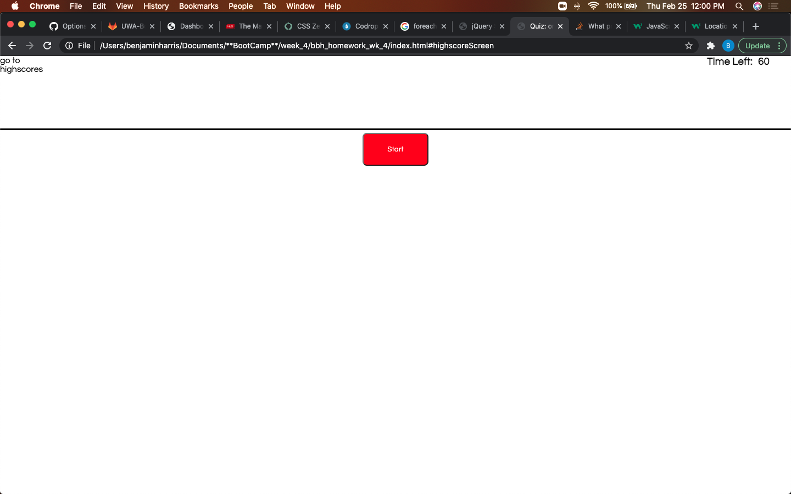
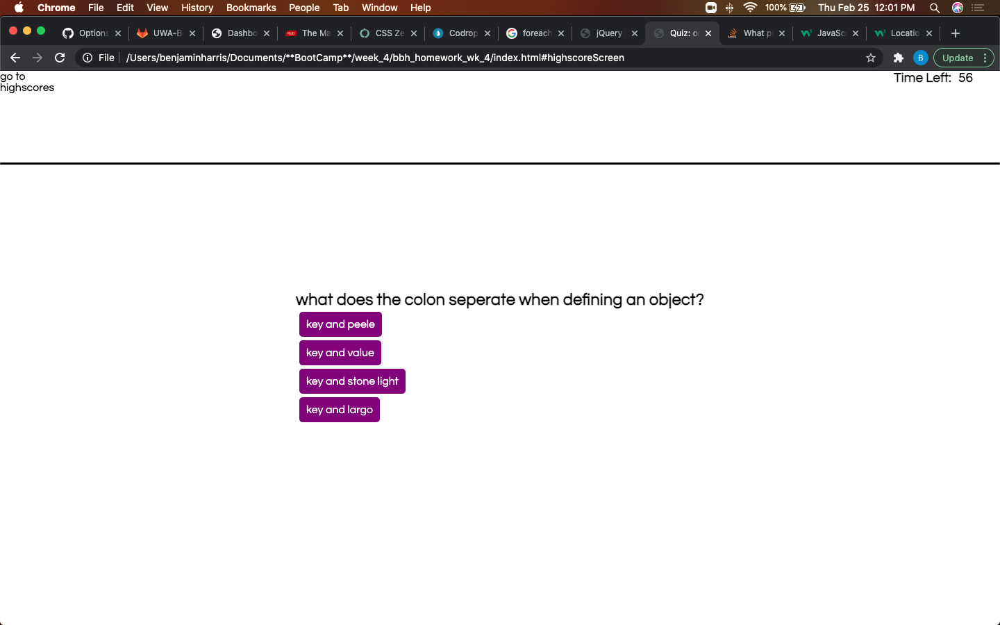
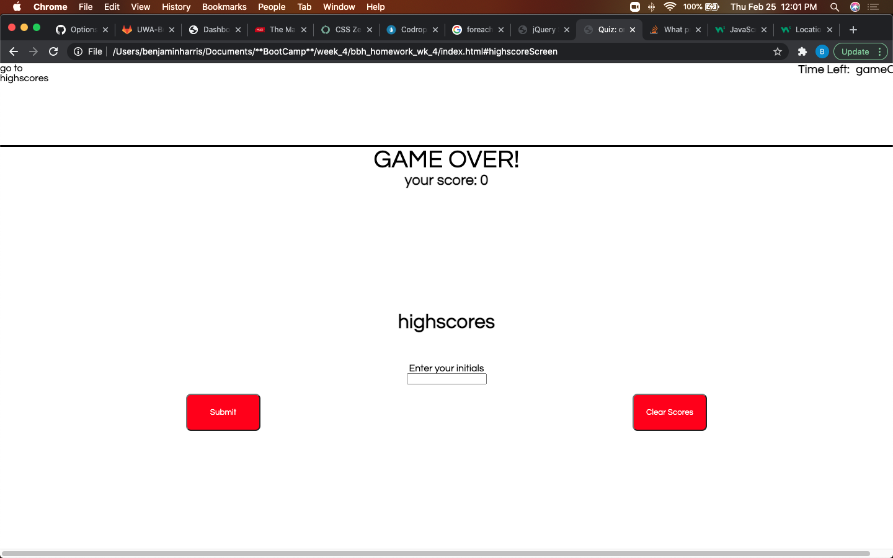
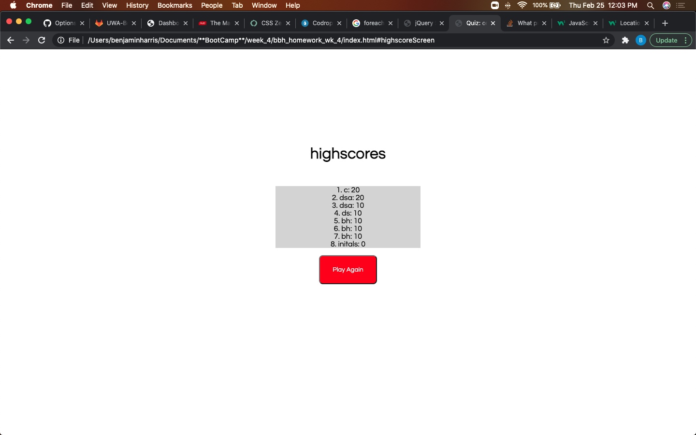

# bbh_homework_wk_4

Quiz: on coding

This is a short multiple choice quiz. The start button starts the timer and prompts the first question. Correct answers are worth 10 points and incorrect answers take 15 seconds off the timer. The users score can be stored and and ranked in the highscores list. The user can also clear the list. 

The questions and answers are generated dynamicly on the DOM using javascript. The highscore functionality includes creating, styling and inserting text with javascript. The button functionality uses event delegation and a long conditional. 

[deployed wibsite](https://harben31.github.io/bbh_homework_wk_4/)

Screenshots:

